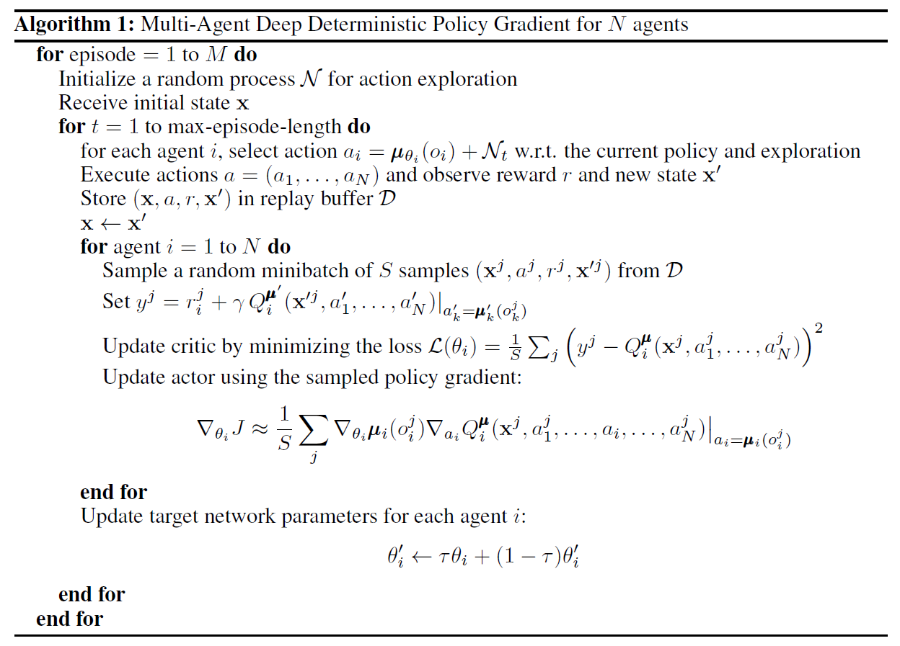
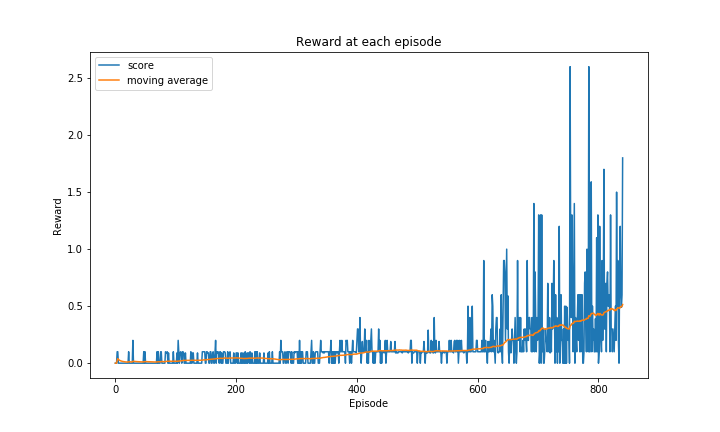

# **Udacity Deep Reinforcement Learning Nanodegree**

## Project 3: Collaboration and Competition

Author: Abhijeet Biswas

### Introduction

For this project, I worked with the [Tennis](https://github.com/Unity-Technologies/ml-agents/blob/master/docs/Learning-Environment-Examples.md#tennis) environment.

In this environment, two agents control rackets to bounce a ball over a net. If an agent hits the ball over the net, it receives a reward of +0.1.  If an agent lets a ball hit the ground or hits the ball out of bounds, it receives a reward of -0.01.  Thus, the goal of each agent is to keep the ball in play.

The observation space consists of 24 variables corresponding to the position and velocity of the ball and racket. Each agent receives its own, local observation.  Two continuous actions are available, corresponding to movement toward (or away from) the net, and jumping. 

### Solving the Environment

The task is episodic, and in order to solve the environment, your agents must get an average score of +0.5 (over 100 consecutive episodes, after taking the maximum over both agents). Specifically,

- After each episode, we add up the rewards that each agent received (without discounting), to get a score for each agent. This yields 2 (potentially different) scores. We then take the maximum of these 2 scores.
- This yields a single **score** for each episode.

The environment is considered solved, when the average (over 100 episodes) of those **scores** is at least +0.5.

### Learning Algorithm

I have implemented [Multi-Agent Actor-Critic for Mixed Cooperative-Competitive Environments](https://arxiv.org/pdf/1706.02275.pdf).

The goal of collaboration and competition among agents is achieved by adopting the framework of centralized training with decentralized execution. The policies use extra information to ease training, so long as this information is not used at test time. The method is a simple extension of actor-critic policy gradient methods where the critic is augmented with extra information about the policies of other agents.

I have used Deep Deterministic Policy Gradient (DDPG) method for training in this multi-agent setting. DDPG is a model-free algorithm based on deterministic policy gradients that operate on high-dimensional continuous action spaces. It consists of Actor and Critic which learns from off-policy data. Similar to Deep Q Network (DQN), it also uses Replay Buffer and Target networks with soft updates to stabilize the training. Total 8 networks are used,for each of the 2 agents, we have 2 (main and target) for actor and critic each. This setting is also called Multi-Agent DDPG (MADDPG).

The actor function $\mu(s|\theta^{\mu})$ maps the states into actions in a deterministic manner, and the critic of each agent $Q(s_1,s_2..s_N,a_1,a_2,..a_N| \theta^{Q})$ takes states and actions of all the $N$ agents as input and outputs Q values. The critic is updated using the Bellman equation as in Q-learning (shown in the image below). The actor takes in the state and outputs action, this state and action are fed to the critic. The actor is updated in such a way that the action of the actor maximizes the expected Q value output by the critic for that state of the agent and also states and actions of other agents . This is evaluated using the chain rule as shown in the actor update step in the image below.

Ornstein-Uhlenbeck process is used to generate temporally correlated noise. This noise is added to the action output of the actor for exploration.

Following is the complete algorithm:

### CODE

The code is written in Python 3.6.3 and uses PyTorch 0.4.0. I have used detailed comments to explain all the steps.

### Network Architecture

- I have used  8  neural networks (Actor Main, Actor Target, Critic Main & Critic target, for each of 2 Agents), where each network has 4 layers.
- For Actors, there are 24(states), 512, 256 and 2(actions) neurons in each layer respectively.
- For Critic, there are 52 (states(24) \* num_agents(2) + actions(2) \* num_agents(2)), 512, 256 and 1 (Q value) neurons in each layer respectively.
- The first layer takes in the input which is states in case of Actor, and states & actions for all agents in case of Critic of each agent.The last layer outputs the action for Actor and Q value for critic respectively. Intermediate layers are used to build more complex features from input that will produce better results.
- I have used [ReLU](https://en.wikipedia.org/wiki/Rectifier_(neural_networks)) activation  and Dropout with 0.1 probability after each layer except the last one. For Actor, I have used tanh in the last layer to bound the actions between -1 and 1.

#### Other Hyperparameters

- tau: Used For soft update of target network, 0.2

- learning_rate_actor:  Learning rate for actor, 1e-4 

- learning_rate_critic: Learning rate for critic, 1e-4 

- gamma: discounting factor, 0.99                  

- BUFFER_SIZE: Replay buffer  size, 1e6 

- BATCH_SIZE: Minibatch size, 512

- UPDATE_EVERY: Episode Interval for network update, the network was updated after every episode     

- NUM_UPDATES: Number of passes over the data at each update step, 2 was used

### Results

The environment got solved in 841 episodes by having average reward (0.51) over 100 consecutive episodes. The below plot shows the reward received after each episode

### Future Ideas

1. Use prioritized replay buffer to replay important transitions more frequently, and therefore learn more efficiently.
2. Use Multi-agent Proximal Policy Optimization to compare the performance against MADDPG
3. Train the network to obtain higher score than 0.5 and also try out other hyperparameters tuning for better training performance.
